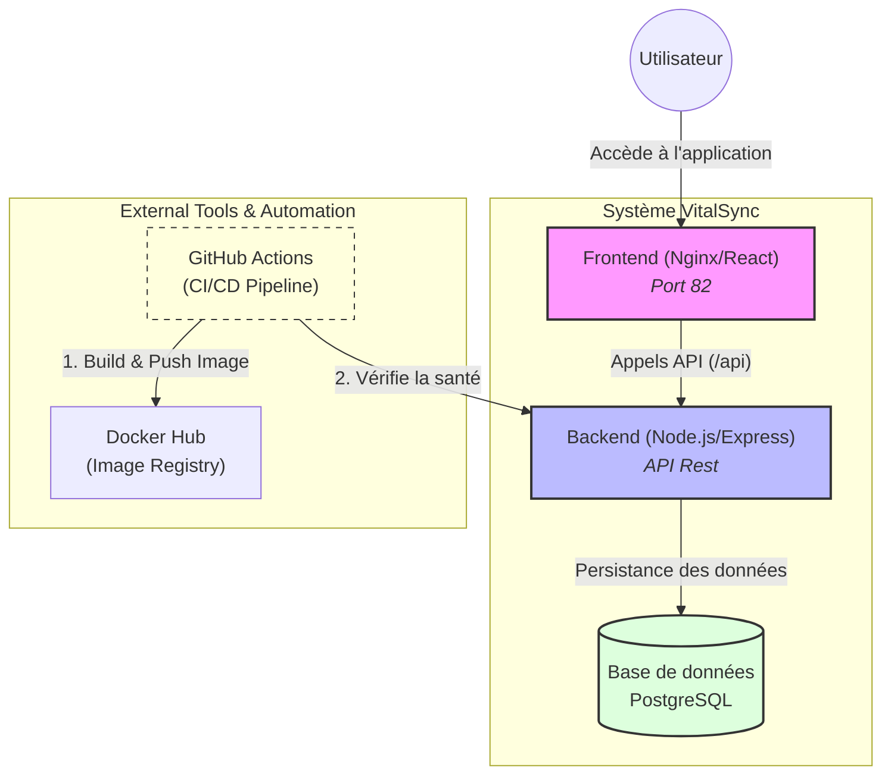

# VitalSync

Application de suivi médical et sportif composée d'un backend Node.js/Express, d'un frontend statique servi par Nginx, et d'une base de données PostgreSQL.

## Architecture

Le projet est organisé autour de trois services conteneurisés orchestrés par Docker Compose :

- **backend** : API REST Node.js/Express exposée sur le port 3003
- **frontend** : interface HTML servie par Nginx sur le port 82, avec proxy des requêtes `/api/*` vers le backend
- **database** : PostgreSQL 16 avec volume persistant



## Prérequis

- Docker 24+
- Docker Compose 2+
- Git 2.40+
- Node.js 20+ (pour le développement local sans Docker)

## Lancer le projet en local

```bash
cp .env.example .env
# Remplir les valeurs dans .env

docker-compose up --build
```

Le frontend est accessible sur `http://localhost:82`.
L'API est accessible sur `http://localhost:3003`.

## Pipeline CI/CD

La pipeline GitHub Actions se déclenche sur chaque push sur `develop` et sur chaque Pull Request vers `main`. 
Elle exécute dans l'ordre : lint ESLint + tests Jest, build et push des images Docker taguées avec le SHA du commit, déploiement staging avec vérification du health check sur `/health`.

## Choix techniques

Node.js 20 LTS a été retenu pour sa stabilité et son support long terme. 
Les images Docker sont basées sur Alpine pour minimiser la surface d'attaque et la taille des images. 
Le multi-stage build garantit que les outils de développement et de test n'atteignent jamais l'image de production. 
GitHub Actions a été choisi pour son intégration native avec le dépôt Git sans infrastructure CI séparée.